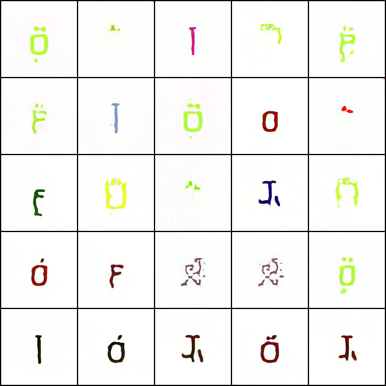
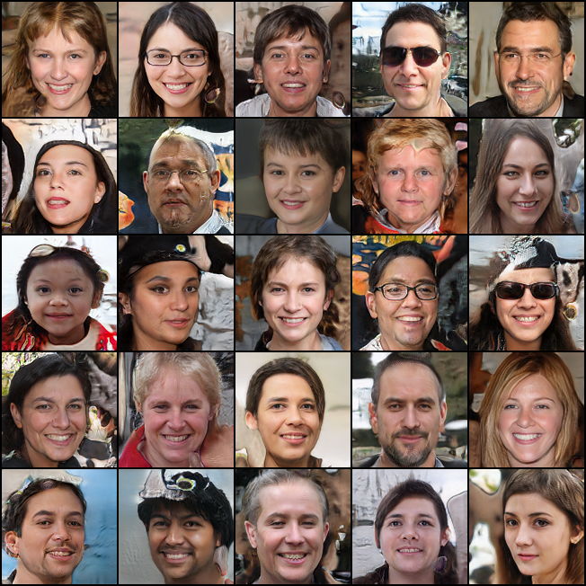
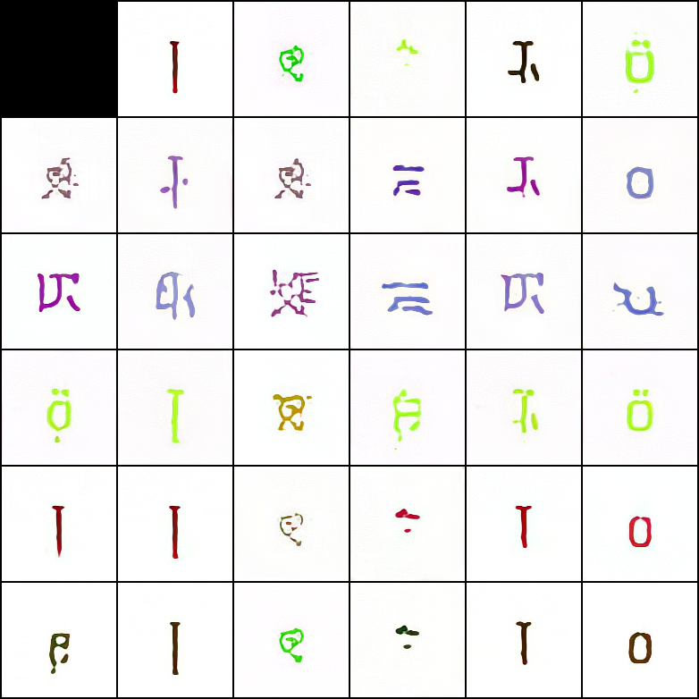
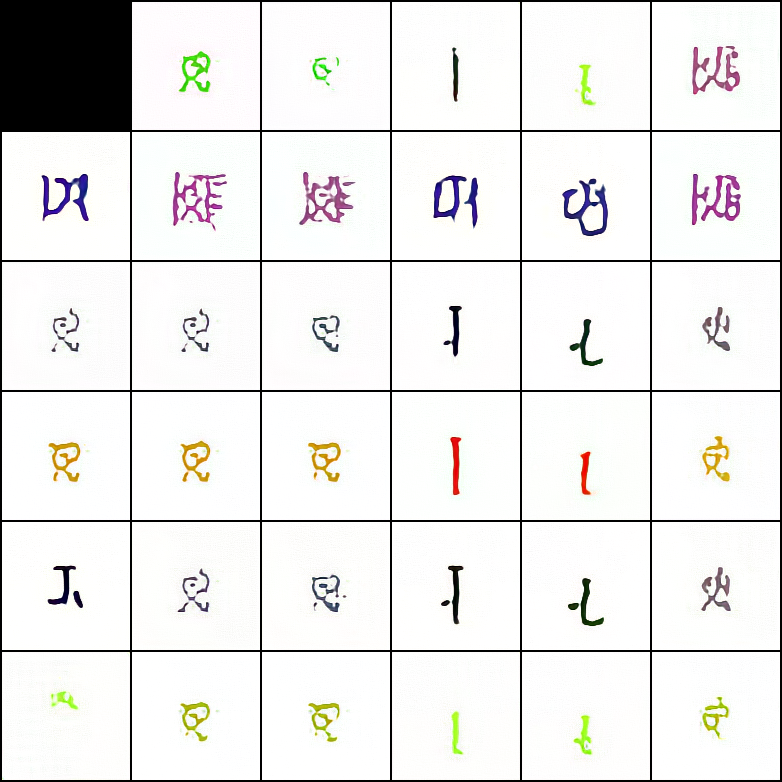
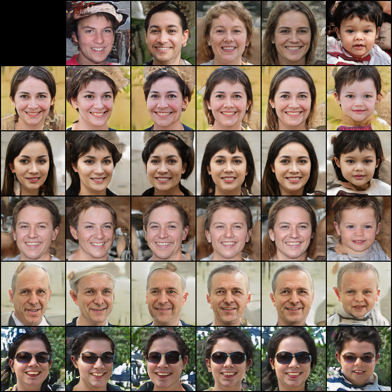

Jittor Implementation of StyleGAN
=================================

## 概况

这个项目是我用 [计图（jittor）](https://github.com/Jittor/jittor) 实现的 StyleGAN，后者是 NVIDIA 公司在 2018 年提出的一种用于图像生成的生成对抗网络。该网络模型相对于此前的模型的主要改进点在于生成器 (generator) 的结构，包括加入了一个八层的 Mapping Network，使用了 AdaIn 模块以及引入了图像随机性——这些结构使得生成器可以将图像的整体特征与局部特征进行解耦，从而合成效果更好的图像；同时网络也具有更优的隐空间插值效果。关于计图平台以及 StyleGAN 的实现细节，可以查看下面的链接：

+ [A Style-Based Generator Architecture for Generative Adversarial Networks](https://arxiv.org/abs/1812.04948)
+ [Jittor: a novel deep learning framework with meta-operators and unified graph execution](https://cg.cs.tsinghua.edu.cn/jittor/papers/)
+ [Jittor 官方文档](https://cg.cs.tsinghua.edu.cn/jittor/)

这个项目的实现也参考了如下链接使用 pytorch 实现的 StyleGAN：

+ [style-based-gan-pytorch](https://github.com/rosinality/style-based-gan-pytorch)

此外，tensorflow 用户也可以参考 NVIDIA 官方实现的版本

+ [StyleGAN - Official TensorFlow Implementation](https://github.com/NVlabs/stylegan)

## 如果获取本项目

您可以直接使用 `git clone` 将本项目拷贝到您的设备上

```
git clone https://github.com/xUhEngwAng/StyleGAN-jittor.git
```

本项目的文件结构如下：

+ `model.py` 定义了 StyleGAN 中生成器（Generator）与判别器的（Discriminator）的结构，前者定义在了 `class StyledGenerator` 当中，后者定义在了 `class Discriminator` 当中。关于 StyleGAN 的模型结构，还会在 [StyleGAN实现细节](#StyleGAN实现细节) 一节进行进一步的阐述；
+ `train.py` 是对模型进行训练的脚本，`resize.py` 则是前期进行数据准备的脚本。关于两者的使用在 [从零开始训练](#从零开始训练) 一节进行说明；
+ `generate.py` 是利用训练好的模型生成图像的脚本。其使用方法会在 [使用预训练模型生成图像](#使用预训练模型生成图像) 一节进行说明；
+ `checkpoint` 文件夹用于保存训练好的模型文件；
+ `sample` 文件夹保存了若干生成好的图像结果。
+ `test` 文件夹保存是我在实现过程中对相关代码进行测试的文件；

为了使用本项目，您首先需要设置好 python 运行环境。计图平台要求使用 Ubuntu 16.04 及以后版本的操作系统，并且 python 版本 >= 3.7。准备好相关环境后，您可以通过以下命令一键安装好本项目需要的依赖：

```
pip install -r requirements.txt
```

其中，关于计图平台的安装，也可以查阅其 [官方文档](https://cg.cs.tsinghua.edu.cn/jittor/download/)。

您可以使用我已经训练好的模型进行符号或者人脸图像的生成，并且查看隐空间插值的效果；抑或您可以使用其他数据集，从零开始训练属于你自己的模型。以下对两种方法分别进行阐述。

### 使用预训练模型生成图像

我分别使用了标准符号数据集（以下称为 color_symbol_7k）与 FFHQ 人脸数据集对网络进行了训练，由于得到的模型文件比较大，我并没有放在本仓库当中。您可以通过以下命令从我的云盘下载到本项目的 `checkpoint` 文件夹中：

```
wget https://cloud.tsinghua.edu.cn/f/70138528932b46a3b3f4/?dl=1 -O checkpoint/color_symbol_7k_40000.model  # color_symbol_7k 预训练模型
wget https://cloud.tsinghua.edu.cn/f/8337c7bec4c34d7a8736/?dl=1 -O checkpoint/FFHQ_80000.model # FFHQ 预训练模型
```

两者支持的最大分辨率都是 128x128，其中前者共进行了 40000 次迭代，后者则进行了 80000 次迭代，均未完全收敛。

获取了模型文件以后，只需要执行 `generate.py`，并以模型文件的路径作为参数，就可以相应地对符号或者人脸图像进行生成了。

```
python generate.py checkpoint/FFHQ_80000.model
```

生成的结果保存在了项目根目录的 `style_mixing` 文件夹下。下图是分别利用上述两个模型生成的符号与人脸图像：

<center>
<table><tr>
    <td></td>
    <td></td>
</tr></table>
</center>

此外，`generate.py` 还对生成的图像进行了隐空间插值，下面两张图是对生成的符号进行隐空间插值的结果：

<center>
<table><tr>
    <td></td>
    <td></td>
</tr></table>
</center>

可以看到，生成的符号整体说来是线条鲜明的，然而存在一些符号其线条的转折并不清晰，并不像是人类的文字，反而更像所谓的 「外星文」，这由于模型训练尚不充分。此外，在生成的符号中，某些模式是反复出现的，此即 GAN 模型中常见的 mode collapse 现象，而 FFHQ 人脸数据集则无此问题。这是由于 FFHQ 数据集包含大量的人脸图像（大约 70000 张），因此模型更不容易产生过拟合。下面两张图展示了对生成的人脸进行隐空间插值的结果：

<center>
<table><tr>
    <td></td>
    <td></td>
</tr></table>
</center>

### 从零开始训练

您也可以自己准备数据集，从零开始训练您自己的 StyleGAN 模型。为了方便，下面我仍然以 color_symbol_7k 数据集为例进行说明。

> 准备数据集

您可以从我的网盘获取 color_symbol_7k 数据集：

```
wget https://cloud.tsinghua.edu.cn/f/a64bcd94a2bd49cd9537/?dl=1 -O color_symbol_7k.zip
unzip color_symbol_7k.zip

# move all images to color_symbol_7k/128 directory
mkdir color_symbol_7k/128
mv color_symbol_7k/*.jpg color_symbol_7k/128/
```

该数据中包含大约 7000 张 Unicode 符号的图像，每张图像的分辨率都是 128x128。StyleGAN 采用渐进式的训练方法，即为了生成 128x128 的图像，该模型首先是被训练生成 8x8, 16x16, 32x32, 64x64 分辨率的图像，该训练方法有助于模型逐步从相对全局的特征过渡到更加细粒度的特征，同时可以加快模型的训练速度。因此，在准备数据集时，也需要同时准备各个分辨率的训练图像。为了简化该步骤，您可以使用根目录下的 `resize.py` 对原始图像的分辨率进行调整，在使用该脚本时同时需要指定图像的目录以及用到的最小分辨率：

```
python resize.py color_symbol_7k/128 --min_size 8
```

该命令会在 `color_symbol_7k` 文件夹下生成若干目录（`64`, `32`, `16`, `8`），各个目录下保存的是对应分辨率的图像。注意各个目录的名称就是对应的分辨率，`dataset.py` 正是通过这一点来加载不同分辨率的图像的。

FFHQ 数据集的准备也是类似，您可以从 [NVIDIA 官方](https://github.com/NVlabs/ffhq-dataset) 下载该数据集。然而该数据集是放在 Google Drive 上的，我用起来感觉非常不友好，下载速度慢并且常常会出现下载中断的情况。因此，我将分辨率为 128x128 的数据集放在了我的云盘上，您可以通过以下命令下载：

```
wget https://cloud.tsinghua.edu.cn/f/f2e886faa51f4ac1992d/?dl=1 -O FFHQ.zip
unzip FFHQ.zip
```

此后的操作和 color_symbol_7k 数据集都是类似的了。为什么不提供更高分辨率的数据集呢？因为我的云盘空间着实是不太够😅。

> 开始训练

准备好数据集后，就可以开始训练了！您可以直接使用 `train.py` 对模型进行训练，同时需要指定数据集的路径，模型使用的最小分辨率等，后者的默认值为 8x8

```
python train.py color_symbol_7k --init_size 8
```

我使用单个 TITAN RTX (24G) GPU 大约训练了十四个小时，可以得到上面人脸图像合成的效果。您可以根据您机器的配置，调整模型当中用到的参数，如 batch_size，最大迭代次数等。

## StyleGAN实现细节

StyleGAN 在生成器模型结构上的创新不可谓不多，其中最主要的包括

+ 使用 Mapping Network 将原始的隐空间向量映射到一个中间向量，从而降低各个特征之间的耦合；
+ 使用中间向量来控制生成图像的特征。引入 AdaIn 模块学习不同层次仿射变换（Affine Transformation）的参数，使得不同分辨率侧重于不同的特征，进一步降低特征间的耦合程度；
+ 显式地引入 noise 模块，并通过全连接层重新编码，控制不同分辨率层次的噪声信息，使得生成的图像更具有多样性；
+ 移除了传统的 Batch Normalization 层次，而是使用了像素层级的 Pixel Normalization 层；
+ 使用了 style mixing 的方法对网络做正则化，防止网络认为相邻层次的特征总是相关的，因此可以更加细粒度地控制生成的图像。

然而所有这些都不是我想要讨论的，因为原论文中已经进行了相当的阐述了。在这一节，我想要讨论的是原论文中没有提及，然而在实际代码实现中却用到的实现细节，主要包括 EqualLR 模块，使用 Minibatch Standard-deviation 增加生成图像的差异性，以及 Fused Upsample/Downsample 模块。（后来发现这些细节好像在 StyleGAN 的前作 ProGAN 论文中提到了😅

> EqualLR 模块

在 StyleGAN 实现中用到的卷积层、全连接层，大多都使用了 EqualLR 类进行封装，下面是我截取的代码片段：

```python
class EqualLR:
    def __init__(self, name):
        self.name = name

    def compute_weight(self, module):
        weight = getattr(module, self.name + '_orig')
        fan_in = weight[0].numel()

        return weight * sqrt(2 / fan_in)

    @staticmethod
    def apply(module, name):
        fn = EqualLR(name)

        weight = getattr(module, name)
        delattr(module, name)
        setattr(module, name + '_orig', weight)
        module.register_pre_forward_hook(fn)

        return fn

    def __call__(self, module, input):
        weight = self.compute_weight(module)
        setattr(module, self.name, weight)

def equal_lr(module, name='weight'):
    EqualLR.apply(module, name)

    return module

# definition of conv & linear module
self.conv = equal_lr(conv)
self.linear = equal_lr(linear)
```

可以看到，EqualLR 这个类做的事情，主要是为输入的模块注册了一个钩子 `module.register_pre_forward_hook`，顾名思义，该钩子会在每次前向传播时被调用，被实际调用的函数为 `compute_weight`。后者首先是读取了输入模块当前的参数，然后按照类似于 `kaiming` 初始化的方式，对模块的参数进行更新。

$$
W = W_{orig} \times \sqrt{\frac{2}{fan_{in}}}
$$

因此，被 EqualLR 包裹的模块，不仅仅参数初始化使用了恺明初始化的方法，在每次前向传播时也要按照恺明初始化的方法进行标准化。这样有助于各个模块的参数具有接近的更新速度，促进生成器与判别器的良性竞争，

> Minibatch Standard-deviation 增加生成图像的多样性

我看查看 pytorch 版本的 Discriminator 代码时，发现下面这个问题：

```python
class Discriminator(torch.nn.Module):
    def __init__(self, fused=True, from_rgb_activate=False):
        super().__init__()

        self.progression = nn.ModuleList(
            [
                ConvBlock(16, 32, 3, 1, downsample=True, fused=fused),  # 512
                ConvBlock(32, 64, 3, 1, downsample=True, fused=fused),  # 256
                ConvBlock(64, 128, 3, 1, downsample=True, fused=fused),  # 128
                ConvBlock(128, 256, 3, 1, downsample=True, fused=fused),  # 64
                ConvBlock(256, 512, 3, 1, downsample=True),  # 32
                ConvBlock(512, 512, 3, 1, downsample=True),  # 16
                ConvBlock(512, 512, 3, 1, downsample=True),  # 8
                ConvBlock(512, 512, 3, 1, downsample=True),  # 4
                ConvBlock(513, 512, 3, 1, 4, 0),
            ]
        )
```

可以注意到，最后一个 `ConvBlock` 输入的通道数是 513 而非 512。期初我以为是这个开发者的失误，后来有了更深入的调研后才发现本应如此。这是由于在 Discriminator 的最后一个层次，还计算了特征图在当前 batch 上的标准差，并将得到的结果作为一个新的特征图加到了原始的输出上，因此该层次的输入本该拥有 513 个通道。

```python
class Discriminator(torch.nn.Module):
    def __init__(self, fused=True, from_rgb_activate=False):
           # initialization code
            
    def forward(self, input, step=0, alpha=-1):
        for i in range(step, -1, -1):
            index = self.n_layer - i - 1

            if i == step:
                out = self.from_rgb[index](input)

            if i == 0:
                out_std = torch.sqrt(out.var(0, unbiased=False) + 1e-8)
                mean_std = out_std.mean()
                mean_std = mean_std.expand(out.size(0), 1, 4, 4)
                out = torch.cat([out, mean_std], 1)
        
        # more code goes here
```

通过这种方法，可以统计当前 batch 内的信息，使得 Discriminator 通过这些额外的统计信息区分真实样本与生成的样本。从而使得 Generator 生成更加多样化，更接近真实样本分布的图片。可以说是相当工程化的实现了。

> Fused Upsample/Downsample 模块

在 Generator 还有 Discriminator 的实现中，都广泛地使用了耦合的上采样与下采样层：

```python
class FusedDownsample(jt.Module):
    def __init__(self, in_channel, out_channel, kernel_size, padding=0):
        self.weight = jt.randn(out_channel, in_channel, kernel_size, kernel_size)
        self.bias = jt.zeros(out_channel)

        fan_in = in_channel * kernel_size * kernel_size
        self.multiplier = sqrt(2 / fan_in)
        self.pad = padding

    def execute(self, input):
        weight = jt.nn.pad(self.weight * self.multiplier, [1, 1, 1, 1])
        weight = (
            weight[:, :, 1:, 1:]  +
            weight[:, :, :-1, 1:] +
            weight[:, :, 1:, :-1] +
            weight[:, :, :-1, :-1]
        ) / 4

        out = jt.nn.conv2d(input, weight, self.bias, stride=2, padding=self.pad)
        return out

class FusedUpsample(jt.Module):
    def __init__(self, in_channel, out_channel, kernel_size, padding=0):
        self.weight = jt.randn(in_channel, out_channel, kernel_size, kernel_size)
        self.bias = jt.zeros(out_channel)

        fan_in = in_channel * kernel_size * kernel_size
        self.multiplier = sqrt(2 / fan_in)
        self.pad = padding

    def execute(self, input):
        weight = jt.nn.pad(self.weight * self.multiplier, [1, 1, 1, 1])
        weight = (
            weight[:, :, 1:, 1:] +
            weight[:, :, :-1, 1:] +
            weight[:, :, 1:, :-1] +
            weight[:, :, :-1, :-1]
        ) / 4

        out = jt.nn.conv_transpose2d(input, weight, self.bias, stride=2, padding=self.pad)
        return out
```

这两个模块前者乃是卷积与平均池化（Average Pooling）的耦合，而后者是转置卷积与平均池化的耦合，下面以 FusedDownsample 为例进行说明。可以看到，在 `__init__` 函数中，首先定义了一个卷积核（`self.weight`），并对其使用恺明初始化。在 `execute` 函数中，则对该卷积核的四周都加了大小为 1 的 padding，随后将左上、右上、左下、右下四个子卷积核做了算数平均，读者可以自行验证，该操作等价于对特征图先做卷积，再做平均池化。通过这种方法，可以减少数据流动的层次，在一定程度上加速运算，使得模型训练得更快。

## LICENSE
